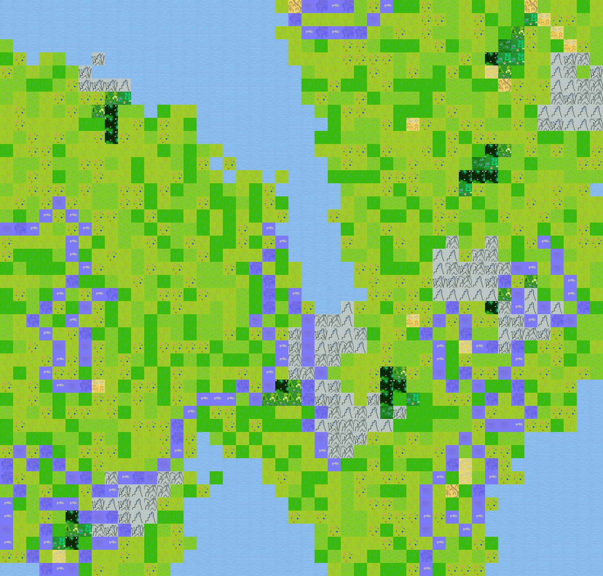
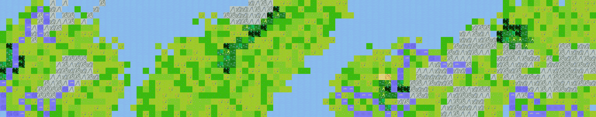

# Hic Sunt Random
Hic Sunt Random is a simple random map generator.  
It creates a map image based on a set of tiles and parameters.  

  

## How to Install
Install OpenCV library:
```
pip install opencv-python
```

## How to Use
Run Hic Sunt Random with default parameters and default tiles:
```
python main.py
```

Run Hic Sunt Random with random parameters and default tiles:
```
python main.py --randomize_parameters
```

Run Hic Sunt Random with user-defined parameters:
```
python main.py --worlds_amount=2 --world_width=100 --world_height=200 --river_length=60 --city_growth_rate=10 --city_seeds_amount=2
```

List all parameters:
```
python main.py --help
```

Run Hic Sunt Random with custom tiles:
```
1. Replace default tiles in resources/tiles folder with custom one, keeping the original names.
2. Add more tiles of the same type, keeping naming convention type_index (lake_5).
3. python main.py
4. Enjoy! ^_^
```

## Examples
  

## License
Apache License 2.0  
In short, your are free to use (including commercial), copy, modify, dance, sing, distribute.
